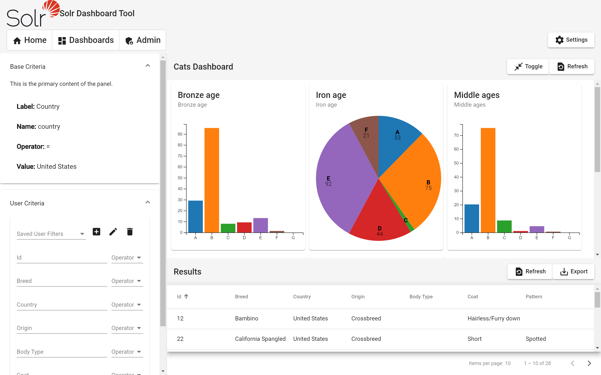

# SDT

## Solr Dashboard Tool

## Introduction

This tool is designed to allow users to create a visual based dashboard of solr indexes. The dashboard configuration tool uses a wizard style UI to create dashboards that configuration data it stored within the browser local storage. Users can point to different indexes on different domains. Facet based data can be disected to product chart with drill down approach.  

## Goals of Project

This is standalone tool to provide custom visual dashboards of solr index with Material Angular and Angular CLI

## Prerequisites
- Cross Domain access via CORS or some other method to each of the index domains or app must be hosted on same domain
- Internet Access

## Angular CLI

This project was generated with [Angular CLI](https://github.com/angular/angular-cli) version 9.1.1.

## Development server

Run `ng serve` for a dev server. Navigate to `http://localhost:4200/`. The app will automatically reload if you change any of the source files.

## Code scaffolding

Run `ng generate component component-name` to generate a new component. You can also use `ng generate directive|pipe|service|class|guard|interface|enum|module`.

## Build

Run `ng build` to build the project. The build artifacts will be stored in the `dist/` directory. Use the `--prod` flag for a production build.

## Running unit tests

Run `ng test` to execute the unit tests via [Karma](https://karma-runner.github.io).

## Running end-to-end tests

Run `ng e2e` to execute the end-to-end tests via [Protractor](http://www.protractortest.org/).

## Further help

To get more help on the Angular CLI use `ng help` or go check out the [Angular CLI README](https://github.com/angular/angular-cli/blob/master/README.md).
